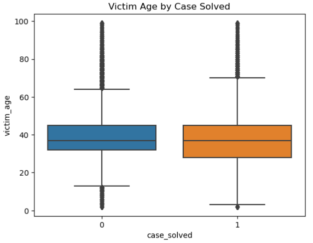
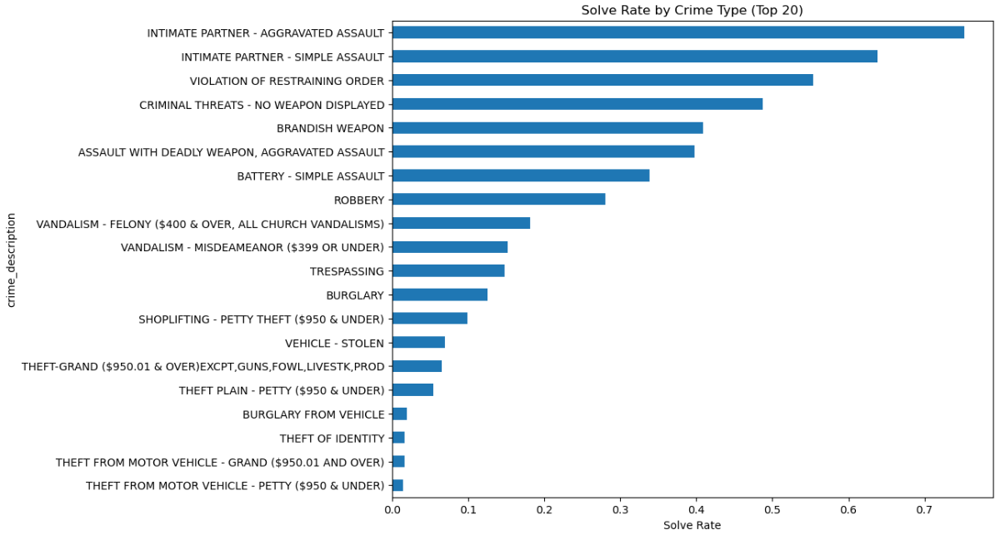
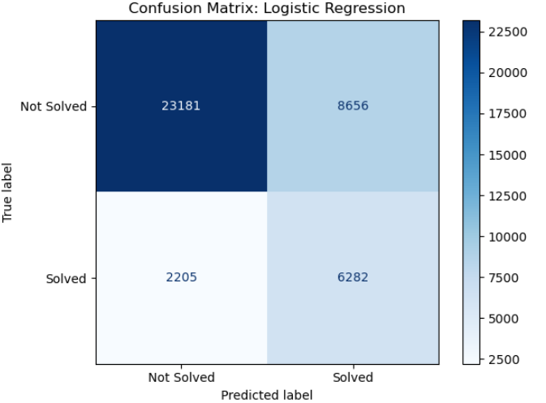
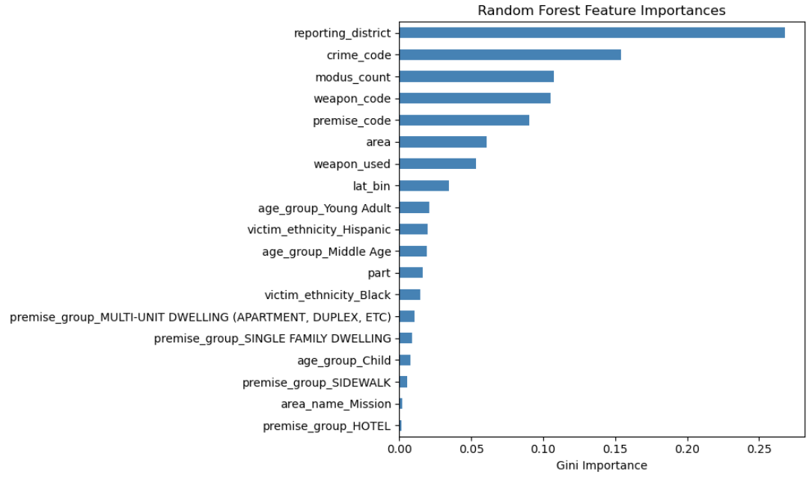

# Crime Data Analysis: Predicting Case Solvability

### Course Project | Python for Data Analytics | University of Niagara Falls

> **Author:** Rosario Torres  
> **Tools Used:** Python, Pandas, Matplotlib, Seaborn, scikit-learn

---

## Overview

An end-to-end data analysis and modeling project exploring crime trends and case solvability—developed as part of my Master’s coursework at UNF. This project explores a crime dataset (similar to the SF Crime Dataset) to uncover patterns in crime types, demographics, and case outcomes. The goal was to build an end-to-end machine learning pipeline that predicts whether a case is likely to be **solved or unsolved** based on available features.

---

## Purpose

- Practice **data cleaning**, **EDA**, and **machine learning modeling** on a real-world-like dataset
- Identify **patterns in case solvability** across location, age, gender, ethnicity, and crime type
- Build classification models to predict the likelihood of a case being solved
- Reflect on social and ethical considerations in analyzing crime and demographic data

---

## Process

### 1. Data Cleaning
- Removed duplicates and handled missing values
- Merged rare ethnicity values into common categories
- Ensured consistent formats for gender, location, and date fields

### 2. Exploratory Data Analysis (EDA)
- Crime trends across **age groups**, **gender**, and **ethnicity**
- Spatial distribution of **unsolved cases by location**
- Temporal analysis: frequency by year and month
- Correlation matrix for numeric variables

### 3. Feature Engineering
- Extracted features from timestamps (year, month)
- One-hot encoding for categorical features
- Binarized target variable: `Solved` vs. `Unsolved`

### 4. Predictive Modeling
- Built **Logistic Regression** and **Decision Tree Classifier**
- Compared performance using:
  - Accuracy
  - Confusion matrix
  - Classification report
- Assessed **feature importance**

---

## Key Results

- **Ethnicity**, **location**, and **crime type** were strong predictors of solvability
- Unsolved crimes showed clustering in specific locations
- **Decision Tree** slightly outperformed Logistic Regression with higher interpretability
- Feature importance revealed that crime type and neighborhood had notable weight

---

## Recommended Visuals to Showcase

Below are key visualizations featured in the notebook and project folder:

1. **Unsolved Crimes by Neighborhood**
   > Visualizes the geographic distribution of unsolved cases, revealing hotspots or patterns in specific districts or zones.  
   

2. **Case Outcome by Age Group**
   > Highlights age-related patterns in case solvability, suggesting which victim age groups are more often associated with unsolved crimes.  
   

3. **Crime Type vs. Solved Rate**
   > Compares how different types of crimes correlate with resolution rates, showing which crime categories are more or less likely to be solved. 
   

4. **Confusion Matrix for Final Model**
   > Evaluates the performance of the classification model by showing true positives, false positives, true negatives, and false negatives.
   

5. **Feature Importance (Random Forest Tree)**
   > Ranks the most influential features used by the Randome Forest model to predict case solvability, aiding interpretability.
   

## See full analysis in the [Jupyter Notebook](./Crime_Analysis_Notebook.ipynb)
---

## What I Learned

- How to clean and standardize messy, real-world data
- The importance of thoughtful feature engineering in classification tasks
- That model performance can differ significantly based on how the target variable is defined
- How sensitive demographic and geographic data should be interpreted responsibly
- These lessons inform how I approach model design, data ethics, and real-world problem solving in future projects.

---

## Notes

- The dataset is used only for educational purposes and cannot be shared publicly. It resembles the **San Francisco Crime Dataset**, which can be referenced for similar analysis.
- The project emphasizes **methodology and interpretation** rather than conclusions about specific communities.

---

## Future Improvements

I’m excited to expand this analysis using ensemble methods, interactive dashboards, and richer geospatial tools like Geopandas.
Here's a good plan or suggestions for my future self when i get the time:
- Try ensemble models like **Random Forest** or **Gradient Boosting**
- Perform **time series forecasting** on crime frequency
- Build an interactive dashboard using **Dash** or **Streamlit**
- Use **geopandas** for richer spatial visualizations

---

